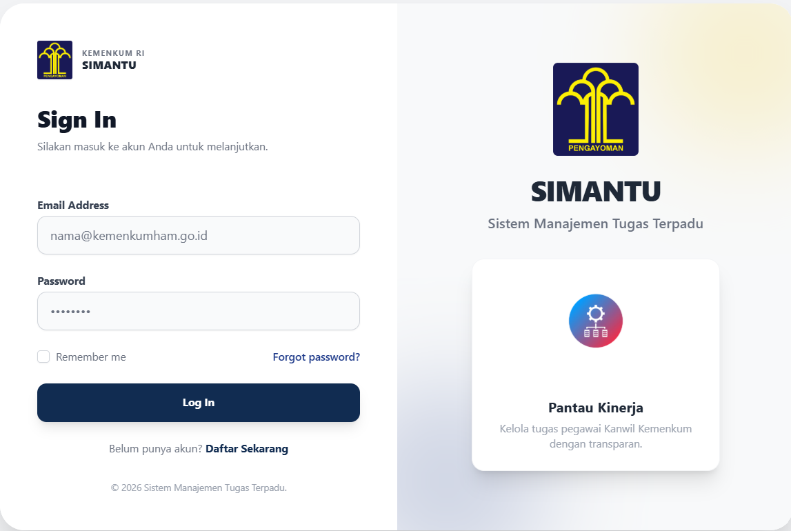
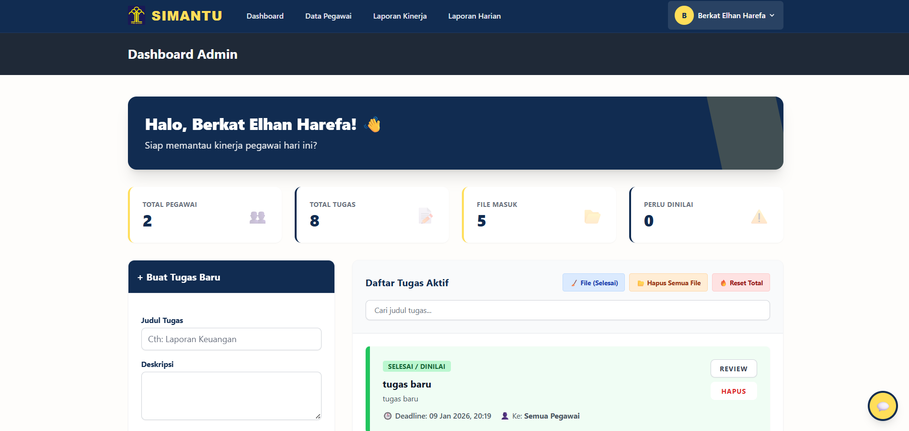

# SIMANTU-Kemenkum-Sumut

# website-pegawai

## Deskripsi singkat

`website-pegawai` SIMANTU adalah aplikasi web berbasis Laravel untuk manajemen pegawai, penugasan, pengumpulan tugas (submissions), dan komunikasi internal (chat). Project ini menggunakan model utama `User`, `Task`, `Submission`, dan `Chat` untuk merepresentasikan alur kerja pegawai.

## Tampilan Aplikasi

Berikut adalah tampilan antarmuka aplikasi SIMANTU:

**1. Halaman Login**


**2. Dashboard Admin**


## Fitur utama

- Autentikasi pengguna (login/register)
- Pembuatan dan penugasan `Task`
- Pengumpulan tugas melalui `Submission` dengan lampiran dan catatan
- Sistem `Chat` antar pengguna untuk komunikasi internal
- Migrasi dan seeder untuk inisialisasi data

## Persyaratan

- PHP (disarankan PHP 8.0+)
- Composer
- Node.js & NPM (untuk Vite dan asset)
- Database (MySQL / MariaDB / PostgreSQL)

## Instalasi (development)

Langkah singkat untuk menjalankan aplikasi secara lokal:

```powershell
git clone <repo-url>
cd website-pegawai
composer install
copy .env.example .env
php artisan key:generate
```

Konfigurasi koneksi database dan variabel lingkungan pada file `.env`.

## Migrasi & Seeder

Setelah `.env` dikonfigurasi jalankan:

```powershell
php artisan migrate
php artisan db:seed
```

Jika ingin reset semua data saat development:

```powershell
php artisan migrate:fresh --seed
```

## Menjalankan aplikasi (development)

Frontend menggunakan Vite. Jalankan perintah berikut di terminal:

```powershell
npm install
npm run dev
```

Jalankan server Laravel:

```powershell
php artisan serve
```

Untuk membuat build produksi frontend:

```powershell
npm run build
```

## Storage

Jika aplikasi membutuhkan akses file publik jalankan:

```powershell
php artisan storage:link
```

## Testing

Menjalankan test dengan PHPUnit:

```powershell
./vendor/bin/phpunit
```

## Struktur penting

- `app/Models` — model `User`, `Task`, `Submission`, `Chat`
- `app/Http/Controllers` — controller aplikasi
- `database/migrations` — migrasi database
- `database/seeders` — seeder data
- `resources/js` & `resources/css` — asset (Vite)

## Kontribusi

Silakan buka issue atau kirim pull request. Sertakan deskripsi perubahan dan langkah reproduksi bila perlu.

## Lisensi

Lihat file `LICENSE` pada repositori jika tersedia. Jika tidak ada, tanyakan kepada pemilik repo untuk informasi lisensi.

## Kontak

Untuk pertanyaan atau akses environment, hubungi pemilik proyek atau tim pengembang.

tesss
